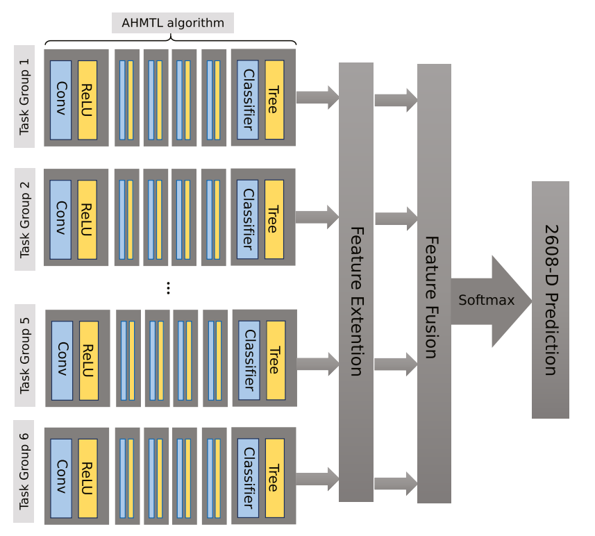
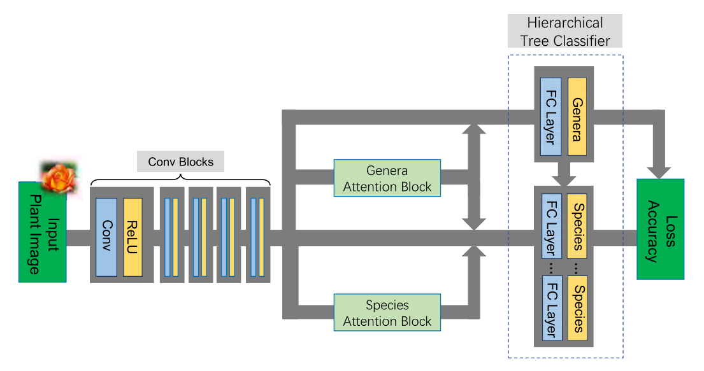

# Aggregating diverse deep attention networks for large-scale plant species identification

## Introduction
In this project, a novel fusion method is proposed to deal with large-scale plant species identification by aggregating diverse outputs from multiple deep networks, where each deep network focus on one subset of the whole plant species. It mainly contains three steps:
* Firstly, a fixed plant taxonomy is constructed for organizing large number of fine-grained plant species hierarchically and it is further used as a guideline to help generating diverse but overlapped task groups.
* Secondly, an attention-based deep hierarchical multi-task learning (AHMTL) algorithm is proposed to recognize fine-grained plant species belonging to the same task group effectively by learning more discriminative deep features and classifiers jointly. 
* Finally, we fuse all outputs from multiple deep networks to obtain the final high-level feature representation and give the prediction probability for each plant species. 

The experimental results have proved the effectiveness of our proposed method on large-scale plant species identification.

## Figure
### Flowchart
The flowchart of our fusion method for fusing extended outputs from all 6 deep networks for recognizing 2608 plant species in the ‘orchid’ family.

### Structure
The structure of our attention-based hierarchical multi-task learning algorithm.

### Tips
If there is any copyright issue, please contact 592332380@qq.com.